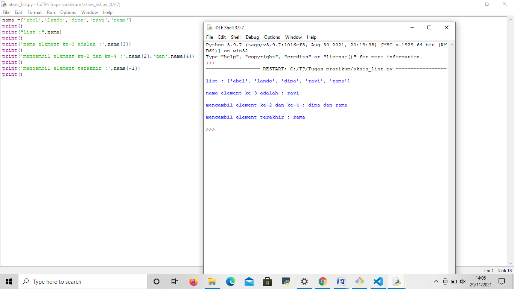
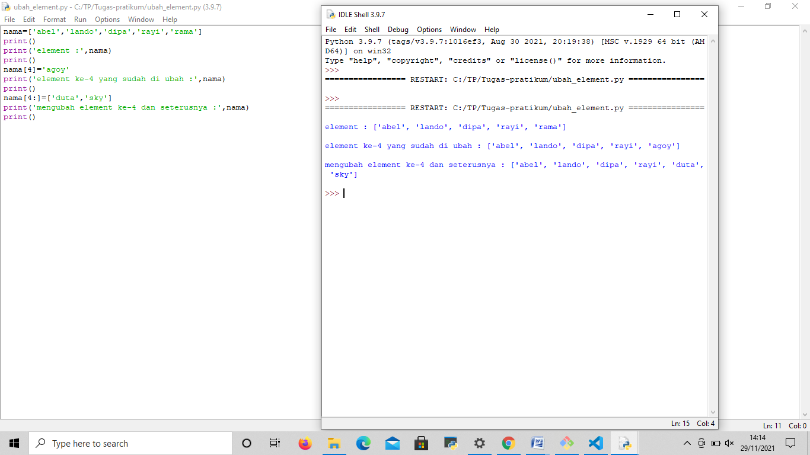
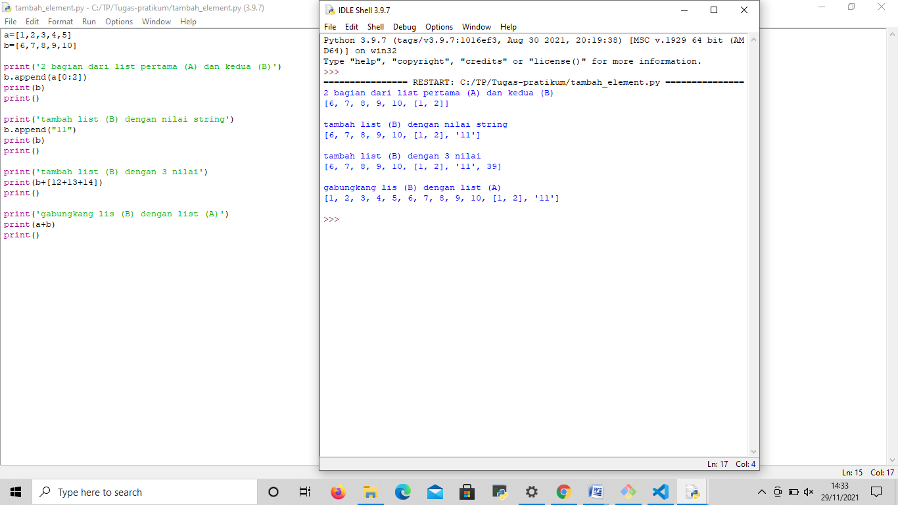

# Tugas-pratikum

## latihan

### akses list
- contoh list
nama : abel, lando, dipa, rayi, rama
- tampilkan elemen ke 3
- ambil elemen ke 2 sampai ke 4
- ambil elemen ke 4 sampai elemen terakhir
```python
nama =['abel','lando','dipa','rayi','rama']
print()
print("list :",nama)
print()
print('nama element ke-3 adalah :',nama[3])
print()
print('mengambil element ke-2 dan ke-4 :',nama[2],'dan',nama[4])
print()
print('mengambil element terakhir :',nama[-1])
print()
```
 

 ### ubah elemen list
 - contoh list
 nama : abel, lando, dipa, rayi, rama
 - ubah elemen ke 4 dengan elemen lainnya
 - ubah elemen ke 4 sampai dengan elemen terakhir

 ```python
 nama=['abel','lando','dipa','rayi','rama']
print()
print('element :',nama)
print()
nama[4]='agoy'
print('element ke-4 yang sudah di ubah :',nama)
print()
nama[4:]=['duta','sky']
print('mengubah element ke-4 dan seterusnya :',nama)
print()
```
 

 ### tambah elemen list
 - ambil 2 bagian list pertama (A) dan jadikan list kedua (B)
 a : 1,2,3,4,5
 b : 6,7,8,9,10
 - tambah list B dengan nilai string
 - tambah list B dengan 3 nilai
 - gabungkan list B dengan list A

 ```python
a=[1,2,3,4,5]
b=[6,7,8,9,10]

print('2 bagian dari list pertama (A) dan kedua (B)')
b.append(a[0:2])
print(b)
print()

print('tambah list (B) dengan nilai string')
b.append("11")
print(b)
print()

print('tambah list (B) dengan 3 nilai')
print(b+[12+13+14])
print()

print('gabungkang lis (B) dengan list (A)')
print(a+b)
print()
```
 